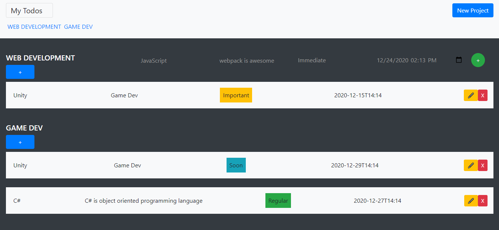

# Todo-List
this is a javascript todos application



## Live Link

- Live: [DEMO](https://rawcdn.githack.com/MahmoudBakr23/Todo-List/5e3b21a8d2adbcbf9ea92d8600b5848f8546cd55/dist/index.html)

## Built with

- Pure JavaScript
- Jest
- DOM properties and attributes
- HTML & SCSS

## Getting Started
To get a local copy of the repository please run the following commands on your terminal:
- ```$ cd <folder>```
- ```$ cd Todo-List ```

To run the tests:
- ```npm install --save-dev @babel/preset-env```
- ```npm run test```

## Authors

👤 **Hoshang Asthana**
- Github: [@Hoshang Asthana](https://github.com/hoshangasthana)

- Linkedin: [Hoshang Asthana](https://www.linkedin.com/in/hoshangasthana/)

- Email: [contact on Gmail](hoshang0291@gmail.com)

##    Contributing

Contributions, issues and feature requests are welcome!

## Show your support

Give a ⭐️ if you like this project!